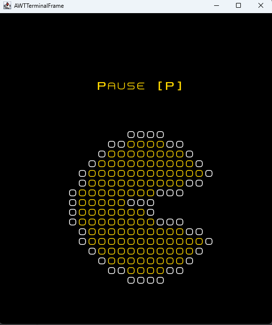
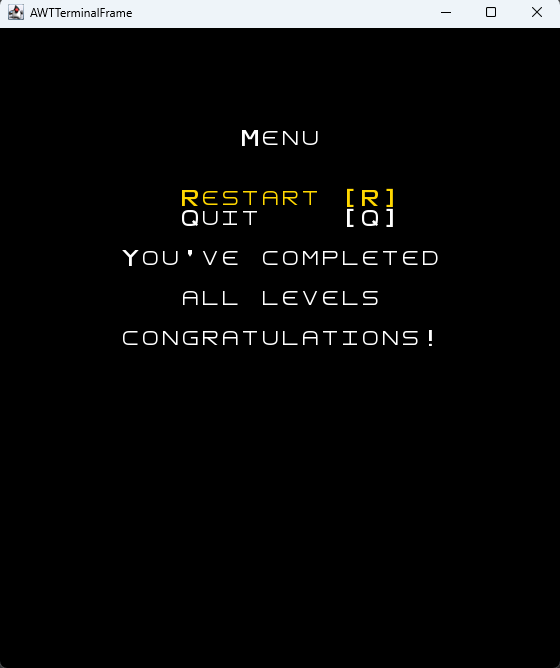

## LDTS_L06Gr01 - Pac-man

In this text-based game inspired by the original 1980 released Pac-Man game, you win by collecting all the coins in the level you are in. You have 3 lives to try and complete the game and each life is taken when the main character makes contact with one of the ghosts/monsters.
The idea of the project is not the game or the complexity of it, but to be able to follow good design practices and use design patters and refactoring to fix code smells, all taught in class.

This project was developed by Gonçalo Martins (up202108707@fe.up.pt), Luís Alves (up202108727@fe.up.pt) and José Caribe (up202103344@fe.up.pt) for LDTS 2021⁄22.
For a more detailed version of this description click [here](./docs/README.md).

## Screenshots

### Game Preview

### Menus

#### Start Menu

#### Pause Menu

#### Next Level Menu

### End Game

#### Win Message

#### Loss Message

This project was developed by Gonçalo Martins (up202108707@fe.up.pt), Luís Alves (up202108727@fe.up.pt) and José Caribe (up202103344@fe.up.pt) for LDTS 2021⁄22.
