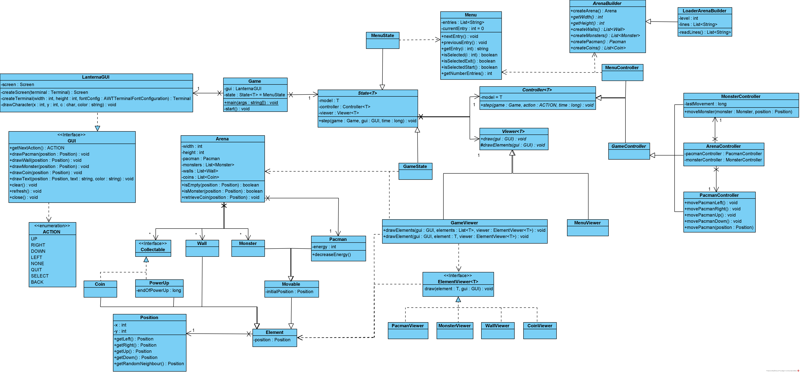
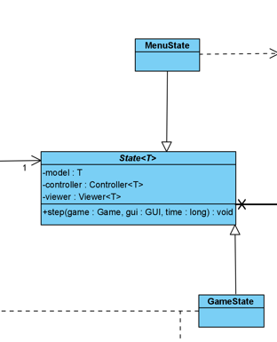
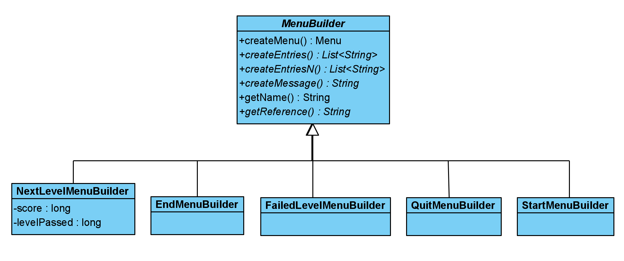
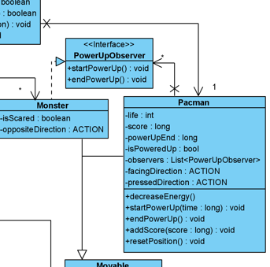
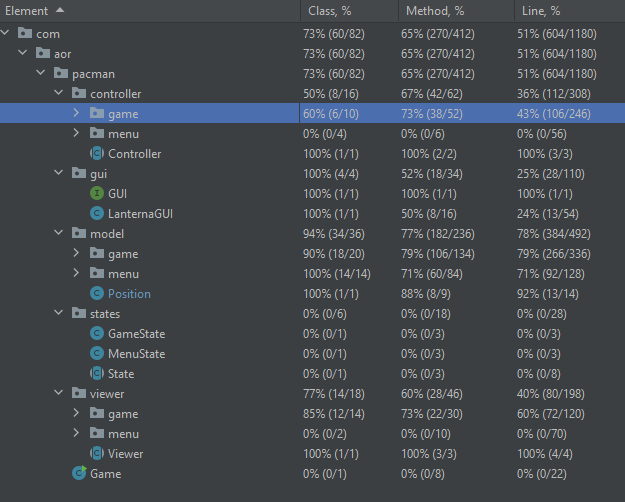

# LDTS_L06Gr01 - Pac-Man

In this text-based game inspired by the original 1980 released Pac-Man game, you win by collecting all the coins in the level you are in. You have 3 lives to try and complete the game and each life is taken when the main character makes contact with one of the ghosts/monsters.
The idea of the project is not the game or the complexity of it, but to be able to follow good design practices and use design patters and refactoring to fix code smells, all taught in class.

This project was developed by Gonçalo Martins (up202108707@fe.up.pt), Luís Alves (up202108727@fe.up.pt) and José Caribe (up202103344@fe.up.pt) for LDTS 2021⁄22.

## IMPLEMENTED FEATURES

- **Movement Input** - The game character will move 1 block on input, if the move is available to him (doesn't hit a wall).

- **Getting coins** - When the game character is on a block that also has a coin, the latter will be removed from said block and the coin counter will be decremented. Once the coin counter reaches 0, the player wins the game.

- **Start Menu** - When loading the game a Start Menu will appear with options to start the game and exit it. When in game you can press q to go back to the Start Menu at any time the client wishes to.

- **Life System** - A player has 3 lives to try and win the game. Every contact with a ghost will take you 1 life.

- **Ghost Enemies** - We have implemented enemies that take away one of the player's lives upon contact with said ghosts.

- **Power Up** - We implemented a power up just like the original game. These will be available in certain points of the map and when collected, they will make Pac-Man invincible for a certain amount of time and make him able to eat the Monsters.

- **Hidden Paths** - This one is also inspired on the original game. There are certain places in the map (frequently on the left and right side), that let you go directly to the other side of the map.

- **Permanent position movement** - The main character continuously moves through the map. This means that you only need to input to change direction. If Pac-Man has room to move in the current direction, he will keep on going until he either dies, changes direction or hits a wall.

- **Game restart after each taken life** - We want the game to restart every time the player loses a life. When the 3 lives are over the game is over.

## PLANNED FEATURES

All the planned features were successfully implemented.

## DESIGN

In the class diagram below, you can see how we modeled our classes in order to best integrate and use the design patterns we choose.

### Model-View-Controller (MVC), State Pattern and Factory Method

#### Problem in Context

Since our game is dealing with a user interface and is divided by different states we chose two design patters to fulfill these needs.

#### The Pattern

Two main patterns were applied to the project, the **Model-View-Controller** architectural pattern which is commonly used in a GUI.
The **State Pattern** which is a behavioral design pattern that lets an object alter its behavior when its internal state changes.
Finally, the Factory Method defines an interface for creating an object, but lets subclasses decide which class to instantiate.

#### Implementation

We now have classes with different main purposes:

- **Store data** (model)
- **Classes that control the game** (controllers)
- **Classes that are responsible for the screen** (viewers)
  
As for the **State Pattern**:

[State Folder](../src/main/java/com/aor/pacman/states)

As you can see in the State Folder classes, we implemented the Factory Method by letting the subclasses which classes (**GameState** and **MenuState**) to instantiate. 

#### Consequences

- **State pattern**: it localizes state-specific behavior and partitions behavior for different states, it makes state transitions explicit and state objects can be shared.
- **Factory methods** eliminate the need to bind application-specific classes into your code. The code only needs to deal with the Product interface, therefore it can work with any user-defined ConcreteProduct classes.

### Menu Builder

#### Problem in Context

We wished to have different types of menus:

- The Start Menu

- The End Menu

- Failed Level Menu

- Next Level Menu

- Quit Menu

#### The Pattern

We used the **Builder** pattern to make the interface menus. It allows the user to construct complex objects step by step making a simpler code.

#### Implementation

Each Menu extends an abstract class **MenuBuilder**, because they are all built the same way. Only what shows on the menu, such as strings, references and entries, for example, are different.

[Builder Folder](../src/main/java/com/aor/pacman/model/menu)

#### Consequences

- The Builder object provides the director with an abstract interface for constructing the product. 
The interface lets the builder hide the representation and internal structure of the product. 
It also hides how the product gets assembled. Because the product is constructed through an abstract interface, all you have to do to change the product's internal representation is define a new kind of builder.

### Power Up Observer

#### Problem in Context

We had to find a way to implement the Power Up feature and make the game itself know when this feature is activated or not.

#### The Pattern

To help us notify the Monsters that the Power Up has been activated by Pac-man, we decided to use the Observer pattern.

#### Implementation

As you can see in the classes below, Pacman has a list of observers and a bool field that, through the PowerUpObserver methods, will notify the Monsters when Pac-Man is powered up.
This will slow down the Monsters and make them 'scared'.

[PowerUpObserver](../src/main/java/com/aor/pacman/model/game/elements/PowerUpObserver.java)

[Pacman](../src/main/java/com/aor/pacman/model/game/elements/Pacman.java)

[Monster](../src/main/java/com/aor/pacman/model/game/elements/Monster.java)

#### Consequences

  - Abstract coupling between subject and observer. 
  - Unexpected updates.

## KNOWN CODE SMELLS

### Move Method

-The step method, originally called in Class **ArenaController**, should be moved to class **Game** because one of its arguments belongs to this class.

-Class **MonsterController** and **PacmanController** have methods that return objects of class **Position**. Therefore, these methods should be moved to class **Position**.

-Class **Arena** implements the getRandomMonsterPosition method that returns an object of class **Position** and has arguments of class **Position** and **Monster**. Therefore, it should be moved to class **Position** or **Monster**.

### Refused Bequest

-There are some cases of **Refused Bequest** code smells. One example of this is the abstract class **Controller** that is extended by **MenuController** and **GameController**.
Both these classes do not use every method they inherited from their parent.

### Data Class

-Most **Model** classes are mainly data classes with most methods being accessors to its fields and methods to alter these fields. There are very few methods that actually have behaviour.
This is caused by the **MVC** architectural pattern which holds the responsibility to the controller to implement the logic functionalities of each model.
This cannot be refactored due to being part of the chosen architectural pattern.

### Large Class

-Some classes have many methods and fields that could have been moved to other classes or been inherited from abstract classes.
Classes **Arena**, **PacmanController** and **MonsterController** are examples of this.

### Inheritance to Delegation

-Classes **PacmanController** and **MonsterController** extend **GameController** but do not really use the method from its parent, only **ArenaController** does.
This inheritance was only done so that **PacmanController** and **MonsterController** could access abstract class **Controller's** methods.
Therefore, Delegation should be used instead of Inheritance.

## TESTING

Test Coverage:

Mutation Testing:

[index.html](../docs/MutationTesting/index.html)

## SELF-EVALUATION

The group easily divided the work so that each student does a separate part of the program. If anyone on the group needs help on a class/function or can't find an error, the rest of the group will help in accordance.

- Gonçalo Martins: 33.3%
- Luís Alves: 33.3%
- José Caribe: 33.3%
